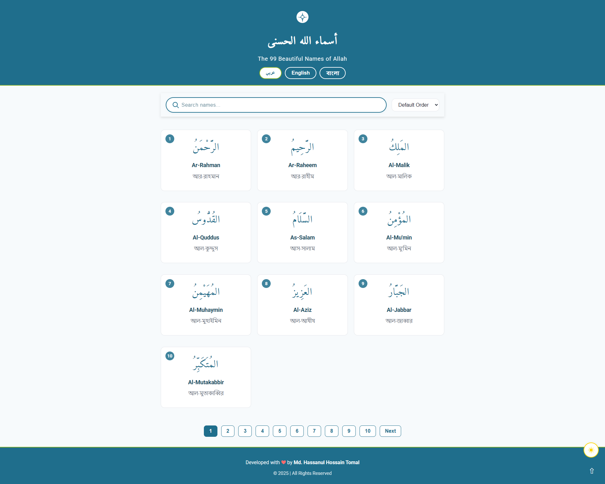
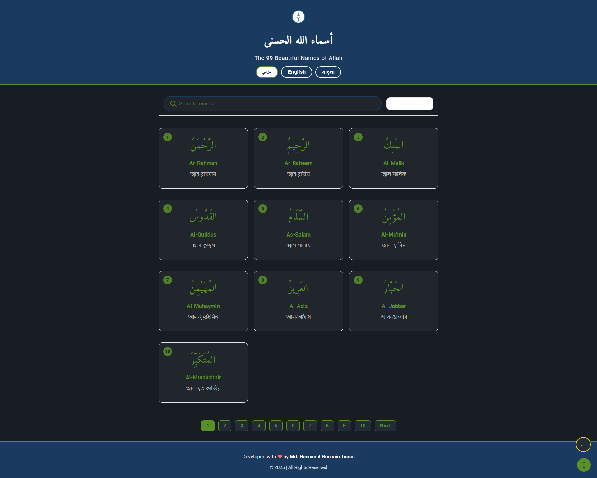

  

<h1 align="center">🌙 99 Names of Allah (Asmaul Husna) Web App 🌙</h1>

  <b>A modern, responsive, and minimal web application to explore the 99 Beautiful Names of Allah (Asmaul Husna)</b> 
  <i>Discover, listen, and reflect on the divine attributes of Allah with meanings, audio, and multilingual support.</i>

  
  
  

---

## 🕌 Features

- **Beautiful, Modern Islamic UI**  
  Subtle geometric patterns, gold accents, and minimalist design.
- **Meanings in Arabic, English, and Bangla**
- **Audio Pronunciation** for each name (Quranic style)
- **Search, Sort, and Pagination** (10 names per page)
- **Sticky Search/Filter Bar**
- **Night Mode Toggle** 🌙
- **Mobile-First, Fully Responsive**
- **No frameworks needed** - pure HTML, CSS, and JavaScript

---

## 📸 Screenshots

  
  

---

## 🚀 Live Demo

**[View the app on GitHub Pages →](https://github.com/hasanulhossaint/99-names-of-allah.git)**

---

## 📝 Getting Started

1. **Clone the repository:**
git clone https://github.com/hasanulhossaint/99-names-of-allah.git

text
2. **Open `index.html` in your browser.**
3. **Or deploy on GitHub Pages for a live site.**

---

## 🌟 Contributing

Contributions, suggestions, and translations are warmly welcome!  
Please open an issue or submit a pull request.

---

## 📚 Credits

- Audio: [mp3quran.net](https://mp3quran.net/ar)
- Icon: [icons8.com](https://icons8.com/icons/set/islam)
- Fonts: [Google Fonts - Amiri & Roboto](https://fonts.google.com/)

---

## 📜 License

This project is licensed under the [MIT License](LICENSE).

---

<b>Developed with &#10084; by Md. Hassanul Hossain Tomal</b>

